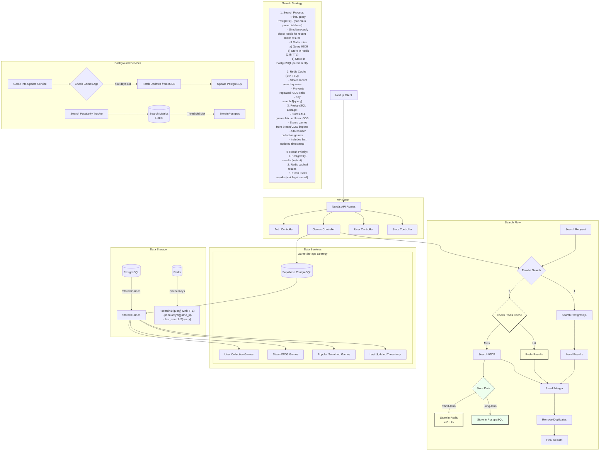

## Architecture Diagram

```mermaid
graph TB
%% Client Layer
Client[Next.js Client] --> NextAPI[Next.js API Routes]

    %% API Layer
    subgraph "API Layer"
        NextAPI --> AuthController[Auth Controller]
        NextAPI --> GamesController[Games Controller]
        NextAPI --> UserController[User Controller]
        NextAPI --> StatsController[Stats Controller]
    end

    %% Search Flow
    subgraph "Search Flow"
        Search[Search Request] --> ParallelSearch{Parallel Search}

        %% PostgreSQL Path (Primary Source)
        ParallelSearch -->|1| PostgresSearch[Search PostgreSQL]
        PostgresSearch --> LocalResults[Local Results]

        %% Redis Cache Path
        ParallelSearch -->|2| RedisCheck{Check Redis Cache}
        RedisCheck -->|Hit| RedisResults[Redis Results]
        RedisCheck -->|Miss| IGDBSearch[Search IGDB]

        %% IGDB Path (When Redis Miss)
        IGDBSearch --> StoreData{Store Data}
        StoreData -->|Short-term| StoreRedis[Store in Redis<br/>24h TTL]
        StoreData -->|Long-term| StorePostgres[Store in PostgreSQL]

        %% Result Merging
        LocalResults --> ResultsMerger[Result Merger]
        RedisResults --> ResultsMerger
        IGDBSearch --> ResultsMerger
        ResultsMerger --> DedupeResults[Remove Duplicates]
        DedupeResults --> FinalResults[Final Results]
    end

    %% Cache Strategy Explanation
    subgraph "Search Strategy"
        direction TB
        SearchFlow["
            1. Search Process:
               - First, query PostgreSQL (our main game database)
               - Simultaneously check Redis for recent IGDB results
               - If Redis miss:
                 a) Query IGDB
                 b) Store in Redis (24h TTL)
                 c) Store in PostgreSQL permanently

            2. Redis Cache (24h TTL):
               - Stores recent search queries
               - Prevents repeated IGDB calls
               - Key: search:${query}

            3. PostgreSQL Storage:
               - Stores ALL games fetched from IGDB
               - Stores games from Steam/GOG imports
               - Stores user collection games
               - Includes last updated timestamp

            4. Result Priority:
               1. PostgreSQL results (instant)
               2. Redis cached results
               3. Fresh IGDB results (which get stored)
        "]
    end

    %% Data Storage Details
    subgraph "Data Storage"
        PostgresDB[(PostgreSQL)]
        RedisCache[(Redis)]

        PostgresDB -->|Stored Games| StoredGames["
            - User collection games
            - Steam/GOG imported games
            - Popular searched games
            - Complete game data
            - Last updated timestamp
        "]

        RedisCache -->|Cache Keys| CacheTypes["
            - search:${query} (24h TTL)
            - popularity:${game_id}
            - last_search:${query}
        "]
    end

    %% Data Services
    subgraph "Data Services"
        GamesController --> ParallelSearch
        GamesController --> GameDB[(Supabase PostgreSQL)]

        %% Game Storage Strategy
        subgraph "Game Storage Strategy"
            GameDB --> StoredGames[Stored Games]
            StoredGames --> UserGames[User Collection Games]
            StoredGames --> ImportedGames[Steam/GOG Games]
            StoredGames --> PopularGames[Popular Searched Games]
            StoredGames --> LastUpdated[Last Updated Timestamp]
        end
    end

    %% Background Update Service
    subgraph "Background Services"
        UpdateService[Game Info Update Service] --> CheckForUpdates{Check Games Age}
        CheckForUpdates -->|>30 days old| FetchUpdates[Fetch Updates from IGDB]
        FetchUpdates --> UpdateGameDB[Update PostgreSQL]

        PopularityTracker[Search Popularity Tracker] --> SearchMetrics[(Search Metrics<br/>Redis)]
        SearchMetrics -->|Threshold Met| StoreInPostgres
    end

    %% Styling
    classDef flow fill:#f9f,stroke:#333,stroke-width:2px
    classDef storage fill:#dfd,stroke:#333,stroke-width:1px
    classDef cache fill:#ffd,stroke:#333,stroke-width:2px
    classDef process fill:#bbf,stroke:#333,stroke-width:1px
    classDef results fill:#ddf,stroke:#333,stroke-width:1px
    classDef store fill:#efe,stroke:#333,stroke-width:2px

    class Client,Search client
    class NextAPI,AuthController,GamesController api
    class ParallelSearch,ResultsMerger service
    class GameDB,SearchMetrics database
    class IGDBSearch external
    class RedisCheck,RedisResults,StoreRedis cache
    class StoreData,StorePostgres store
```
