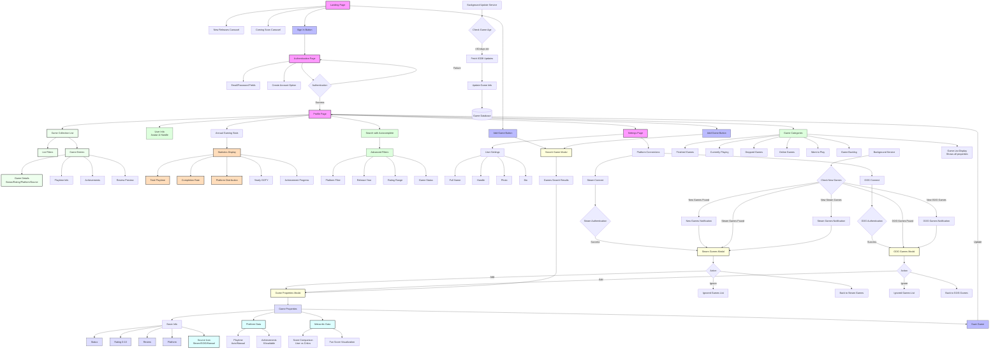

## Application Flow Diagram

```mermaid
graph TD
%% Main Landing Page
Landing[Landing Page] --> NewReleases[New Releases Carousel]
Landing --> ComingSoon[Coming Soon Carousel]
Landing --> SignIn[Sign In Button]
Landing --> AddGame1[Add Game Button]

    %% Authentication Flow
    SignIn --> AuthPage[Authentication Page]
    AuthPage --> EmailPass[Email/Password Fields]
    AuthPage --> CreateAccount[Create Account Option]
    AuthPage --> HandleAuth{Authentication}
    HandleAuth -->|Success| Profile[Profile Page]
    HandleAuth -->|Failure| AuthPage

    %% Enhanced Profile Page Structure
    Profile --> UserInfo[User Info<br/>Avatar & Handle]
    Profile --> AddGame2[Add Game Button]
    Profile --> GameList[Game Collection List]
    Profile --> GameCategories[Game Categories]
    Profile --> Search[Search with Autocomplete]
    Profile --> Settings[Settings Page]
    Profile --> AnnualStats[Annual Gaming Stats]

    %% Game List on Profile
    GameList --> ListFilters[List Filters]
    GameList --> GameEntries[Game Entries]
    GameEntries --> GameDetails[Game Details<br/>Status/Rating/Platform/Source]
    GameEntries --> PlaytimeDisplay[Playtime Info]
    GameEntries --> AchievementsDisplay[Achievements]
    GameEntries --> ReviewPreview[Review Preview]

    %% Annual Stats Details
    AnnualStats --> StatsDisplay[Statistics Display]
    StatsDisplay --> PlaytimeStats[Total Playtime]
    StatsDisplay --> CompletionRate[Completion Rate]
    StatsDisplay --> PlatformBreakdown[Platform Distribution]
    StatsDisplay --> YearlyGOTY[Yearly GOTY]
    StatsDisplay --> AchievementProgress[Achievement Progress]

    %% Enhanced Search & Filtering
    Search --> AdvancedFilters[Advanced Filters]
    AdvancedFilters --> PlatformFilter[Platform Filter]
    AdvancedFilters --> YearFilter[Release Year]
    AdvancedFilters --> RatingFilter[Rating Range]
    AdvancedFilters --> StatusFilter[Game Status]

    %% Settings Page
    Settings --> UserSettings[User Settings]
    UserSettings --> FullName[Full Name]
    UserSettings --> Handle[Handle]
    UserSettings --> Photo[Photo]
    UserSettings --> Bio[Bio]

    %% Platform Connections
    Settings --> Connections[Platform Connections]
    Connections --> Steam[Steam Connect]
    Connections --> GOG[GOG Connect]

    %% Steam Integration Flow
    Steam --> SteamAuth{Steam Authentication}
    SteamAuth -->|Success| SteamGamesModal[Steam Games Modal]
    SteamGamesModal --> SteamGameAction{Action}
    SteamGameAction -->|Add| GamePropertiesModal
    SteamGameAction -->|Ignore| SteamIgnoredGames[Ignored Games List]
    SteamGameAction --> BackToSteamModal[Back to Steam Games]

    %% GOG Integration Flow (mirroring Steam)
    GOG --> GOGAuth{GOG Authentication}
    GOGAuth -->|Success| GOGGamesModal[GOG Games Modal]
    GOGGamesModal --> GOGGameAction{Action}
    GOGGameAction -->|Add| GamePropertiesModal
    GOGGameAction -->|Ignore| GOGIgnoredGames[Ignored Games List]
    GOGGameAction --> BackToGOGModal[Back to GOG Games]

    %% Background Check System
    BackgroundCheck[Background Service] --> CheckNewGames{Check New Games}
    CheckNewGames -->|New Games Found| Notification[New Games Notification]
    Notification --> SteamGamesModal
    CheckNewGames -->|Steam Games Found| SteamGamesModal
    CheckNewGames -->|GOG Games Found| GOGGamesModal
    CheckNewGames -->|New Steam Games| SteamNotification[Steam Games Notification]
    CheckNewGames -->|New GOG Games| GOGNotification[GOG Games Notification]
    SteamNotification --> SteamGamesModal
    GOGNotification --> GOGGamesModal

    %% Background Update Service
    BackgroundUpdate[Background Update Service] --> CheckGameAge{Check Game Age}
    CheckGameAge -->|>30 days old| FetchUpdates[Fetch IGDB Updates]
    FetchUpdates --> UpdateGameInfo[Update Game Info]
    UpdateGameInfo --> GameDB[(Game Database)]

    %% Game Categories with Properties
    GameCategories --> Finished[Finished Games]
    GameCategories --> Playing[Currently Playing]
    GameCategories --> Dropped[Dropped Games]
    GameCategories --> Online[Online Games]
    GameCategories --> Want[Want to Play]
    GameCategories --> Backlog[Game Backlog]

    %% Add Game Flow
    AddGame1 & AddGame2 --> SearchModal[Search Game Modal]
    SearchModal --> GamesList[Games Search Results]
    GamesList --> GamePropertiesModal[Game Properties Modal]

    %% Game Properties
    GamePropertiesModal --> GameProps[Game Properties]
    GameProps --> BasicInfo[Basic Info]
    BasicInfo --> Status[Status]
    BasicInfo --> Rating[Rating 0-10]
    BasicInfo --> Review[Review]
    BasicInfo --> Platform[Platform]
    BasicInfo --> Source[Source Icon<br/>Steam/GOG/Manual]

    %% Platform-Specific Data
    GameProps --> PlatformData[Platform Data]
    PlatformData --> Playtime[Playtime<br/>Auto/Manual]
    PlatformData --> Achievements[Achievements<br/>If Available]

    %% Metacritic Integration
    GameProps --> MetacriticData[Metacritic Data]
    MetacriticData --> ScoreComparison[Score Comparison<br/>User vs Critics]
    MetacriticData --> ScoreVisualization[Fun Score Visualization]

    %% Save Flow
    GameProps --> SaveGame[Save Game]
    SaveGame -->|Update| Profile

    %% Game List Display
    GameCategories --> GameDisplay[Game List Display<br/>Shows all properties]

    %% Styling
    classDef page fill:#f9f,stroke:#333,stroke-width:2px
    classDef button fill:#bbf,stroke:#333,stroke-width:1px
    classDef feature fill:#dfd,stroke:#333,stroke-width:1px
    classDef modal fill:#ffd,stroke:#333,stroke-width:2px
    classDef props fill:#ddf,stroke:#333,stroke-width:1px
    classDef service fill:#fdb,stroke:#333,stroke-width:2px
    classDef stats fill:#fdb,stroke:#333,stroke-width:2px
    classDef integration fill:#dff,stroke:#333,stroke-width:2px
    classDef list fill:#efe,stroke:#333,stroke-width:2px

    class Landing,AuthPage,Profile,Settings page
    class SignIn,AddGame1,AddGame2,SaveGame button
    class Search,UserInfo,GameCategories,AdvancedFilters feature
    class SearchModal,GamePropertiesModal,SteamGamesModal,GOGGamesModal modal
    class GameProps,Status,Rating,Review,Platform props
    class StatsDisplay,PlaytimeStats,CompletionRate,PlatformBreakdown stats
    class MetacriticData,PlatformData,Source integration
    class GameList,GameEntries,GameDetails,ListFilters list
```
